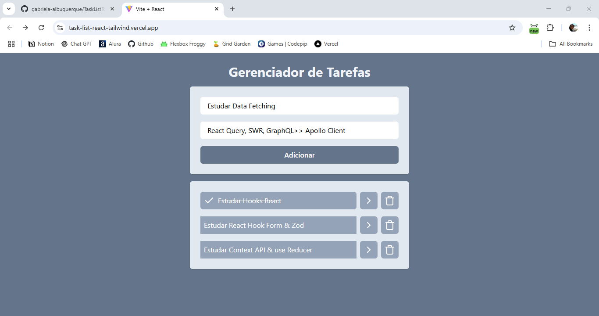

# 📋 Task List React Tailwind

Projeto de **gerenciador de tarefas** construído com **React**, **React Router** e **Tailwind CSS**, focado em componentização, gerenciamento de estado, persistência local e navegação com parâmetros. Desenvolvido para a prática de fundamentos do React em um layout limpo e responsivo.

## 🚀 Funcionalidades

- ✅ Adicionar tarefas com título e descrição
- ✅ Marcar tarefas como concluídas
- ✅ Excluir tarefas da lista
- ✅ Visualizar detalhes da tarefa em outra página
- ✅ Persistência com `localStorage`
- ✅ Navegação com React Router e parâmetros via URL

---

## 🛠️ Tecnologias utilizadas

- **React** – Biblioteca principal para construção da interface
- **Tailwind CSS** – Estilização com classes utilitárias
- **React Router DOM** – Gerenciamento de rotas e navegação
- **Lucide React** – Ícones SVG modernos e acessíveis
- **uuid** – Geração de identificadores únicos
- **Vite** – Ferramenta de build e dev server rápidos
- **ESLint** – Padronização e qualidade de código

---

## 📚 Conhecimentos praticados

- Componentização com `props` e `children`
- Formulários controlados com `useState`
- Uso de `useEffect` para sincronização com o `localStorage`
- Navegação programática com `useNavigate`
- Leitura de parâmetros com `useSearchParams`
- Reutilização de componentes (`Input`, `Button`, `Title`)
- Estilização condicional com Tailwind (ex: `line-through`)
- Organização de rotas com `createBrowserRouter`
- Boas práticas de UX: feedback visual e validação simples

---
